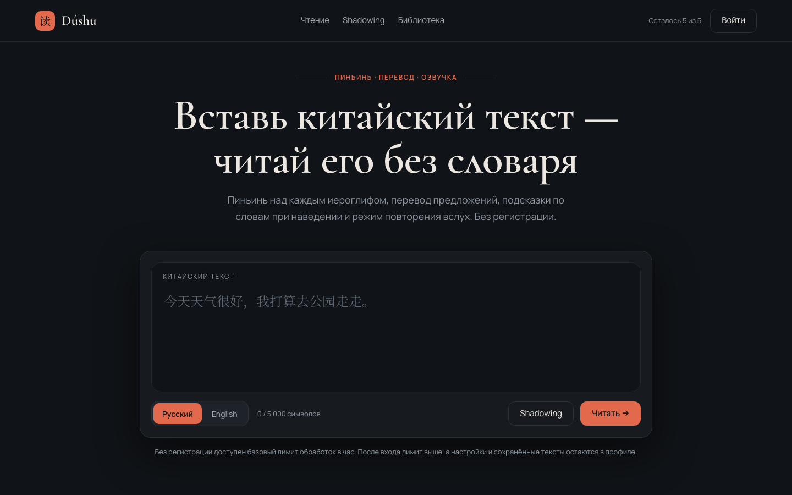
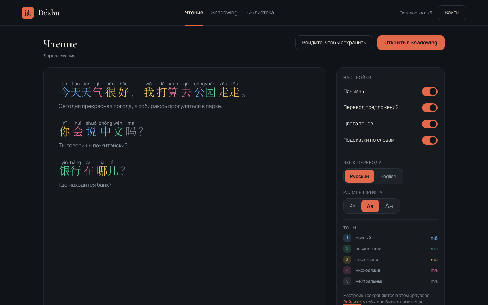
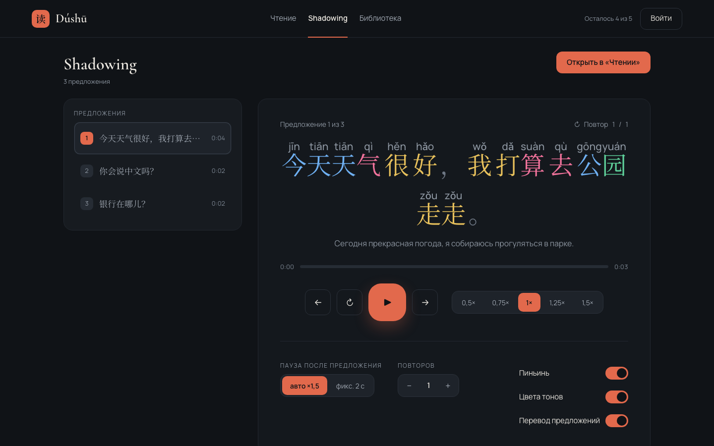

# Dúshū — читай по-китайски

[English](README.en.md)

Веб-приложение для чтения китайских текстов. Вставляешь текст — получаешь его в двух режимах:

- **«Чтение»** — пиньинь над каждым иероглифом, цвета тонов, перевод под предложением
  и словарная статья по наведению на слово;
- **«Shadowing»** — озвучка с караоке-подсветкой звучащего слова и паузой после каждой
  фразы, чтобы повторить её вслух.

Работает без регистрации. Вход нужен только чтобы сохранять тексты и получить лимит повыше.



---

## Содержание

- [Что внутри](#что-внутри)
- [Быстрый старт](#быстрый-старт)
- [Переменные окружения](#переменные-окружения)
- [Словари](#словари)
- [Как это устроено](#как-это-устроено)
- [Как расширять](#как-расширять)
- [Команды](#команды)
- [Ограничения и путь в продакшен](#ограничения-и-путь-в-продакшен)
- [Лицензии словарей](#лицензии-словарей)

---

## Что внутри

**«Чтение».** Текст разбивается на предложения, предложения — на слова (jieba), к каждому
иероглифу подбирается чтение с учётом контекста: 行 в 银行 читается `háng`, а в 不行 — `xíng`.
Пиньинь выводится настоящими `<ruby>`, тон подсвечивается цветом. Перевод предложений — DeepL,
подсказки по словам — из локальной базы, поэтому они появляются мгновенно и ничего не стоят.



**«Shadowing».** Каждое предложение озвучивается отдельно, слово подсвечивается ровно в тот
момент, когда звучит, а после фразы включается пауза — та самая, в которую её надо повторить.
Настраиваются длина паузы, число повторов и скорость от 0,5× до 1,5×.



**Остальное.** Библиотека сохранённых текстов с подборками и статусами чтения, пять общих
уровней HSK, вход по email и через Google, ограничение частоты запросов, настройки отображения,
которые следуют за пользователем между устройствами.

Стек: Python 3.12, Django 5.2, PostgreSQL 16, Django templates и vanilla JS без фронтенд-фреймворка,
Docker, pytest, ruff, GitHub Actions. 461 тест.

---

## Быстрый старт

Нужен только Docker. Локальный Python не используется — внутри контейнера 3.12.

```bash
git clone git@github.com:Said0926/DuShu.git
cd DuShu

cp .env.example .env
# Сгенерировать SECRET_KEY и вписать его в .env:
docker compose run --rm web python -c \
  "from django.core.management.utils import get_random_secret_key as k; print(k())"

docker compose up -d
docker compose exec web python manage.py migrate
```

Готово — http://localhost:8000.

**Проект запускается без единого ключа**, но про перевод есть оговорка. Озвучка работает
сразу: `edge-tts` бесплатен и регистрации не требует. Подсказки по словам появятся после
импорта словарей.

А вот перевода без ключа DeepL не будет. Страница откроется и останется полезной — текст,
пиньинь, тоны, словарь и озвучка на месте, — но под предложениями появится «Перевод сейчас
недоступен». Это осознанно: умирающий внешний сервис не должен уносить с собой страницу.
Чтобы вместо перевода видеть исходный текст и проверить интерфейс целиком, переключись
на заглушку:

```bash
# .env
TRANSLATION_PROVIDER=apps.translation.providers.dummy.DummyProvider
```

Дополнительно:

```bash
# Админка: туда добавляются каталожные тексты для уровней HSK.
docker compose exec web python manage.py createsuperuser

# Письма (подтверждение email, сброс пароля) в разработке печатаются в лог:
docker compose logs -f web
```

---

## Переменные окружения

Все — в `.env`, образец с комментариями лежит в `.env.example`.

| Переменная | Обязательна | Что будет без неё |
|---|---|---|
| `DJANGO_SECRET_KEY` | да | Django не стартует |
| `POSTGRES_*`, `DATABASE_URL` | да | нет базы; значения по умолчанию в образце рабочие |
| `DEEPL_API_KEY` | нет | перевода нет, страница работает с предупреждением |
| `TRANSLATION_PROVIDER` | нет | по умолчанию DeepL; заглушка включается только вручную |
| `TTS_PROVIDER` | нет | по умолчанию `edge-tts`, ключ не нужен |
| `TTS_VOICE` | нет | `zh-CN-XiaoxiaoNeural` |
| `GOOGLE_CLIENT_ID`, `GOOGLE_CLIENT_SECRET` | нет | кнопка «Войти через Google» не рисуется, вход по email работает |

Ключ DeepL Free берётся в аккаунте: Account → API Keys. Выглядит как 36 символов с суффиксом
`:fx`. Бесплатная квота — 500 000 символов в месяц; все переводы кэшируются в базе, поэтому
повторное открытие текста ничего не стоит.

Redirect URI для консоли Google: `http://localhost:8000/accounts/google/login/callback/`.
Ключи Google живут в `.env`, а не в таблице `SocialApp`, чтобы секреты не уезжали в базу.

---

## Словари

Подсказки по словам берутся из локальной базы — два словаря, русский и английский.
Дампы качаются вручную, в репозиторий они не попадают.

```bash
mkdir -p data

# CC-CEDICT (английский), ~124 000 статей
curl -L -o data/cedict.txt.gz \
  https://www.mdbg.net/chinese/export/cedict/cedict_1_0_ts_utf-8_mdbg.txt.gz

# БКРС (русский), ~3 460 000 статей
curl -L -o data/dabkrs.gz https://bkrs.info/downloads/daily/dabkrs_<ГГММДД>.gz

docker compose exec web python manage.py import_cedict data/cedict.txt.gz
docker compose exec web python manage.py import_bkrs data/dabkrs.gz
```

Обе команды читают `.gz` без распаковки и безопасны при повторном запуске. При обновлении
дампа нужен флаг `--replace`: без него изменившиеся статьи будут отброшены как дубликаты,
а устаревшие останутся.

Импорт БКРС занимает несколько минут — записей миллионы.

---

## Как это устроено

Главное требование к архитектуре — расширяемость. Впереди личные словари с интервальным
повторением и статистика, поэтому с первого дня действуют четыре правила.

**Фича — отдельный Django app.** Все они лежат в пакете `apps/`.

| App | Зона ответственности |
|---|---|
| `core` | главная, `base.html`, context processors, конфигурация лимитов |
| `accounts` | пользователь (вход по email), настройки, профиль |
| `chinese` | предложения, сегментация, пиньинь, тоны. Без моделей и без URL |
| `dictionary` | словарные статьи, импорт дампов, поиск |
| `translation` | провайдеры перевода, кэш переводов |
| `tts` | провайдеры озвучки, выравнивание таймингов, кэш аудио |
| `reader` | страница «Чтение» |
| `shadowing` | страница «Shadowing» |
| `library` | сохранённые тексты, подборки, прогресс чтения |

**Зависимости однонаправленны.** Фичи (`reader`, `shadowing`, `library`) зависят от
инфраструктуры (`chinese`, `dictionary`, `translation`, `tts`, `accounts`, `core`), но никогда
друг от друга. Поэтому «Чтение» открывает сохранённый текст, ничего не зная про библиотеку:
заголовок и статус приезжают скрытыми полями формы.

**Логика в `services.py`, views тонкие.** View разбирает запрос, зовёт сервис, отдаёт ответ.
Правила доступа тоже в сервисах, а не в шаблонах.

**Внешние API — только за провайдерами.** Абстрактный базовый класс, конкретные реализации,
выбор через путь к классу в настройках. Никаких прямых вызовов `requests` из views.

Ещё два решения, которые стоит знать:

**Всё платное кэшируется в базе.** Переводы — по хэшу предложения и языку, аудио и тайминги —
по хэшу предложения и голосу. Поэтому предложение, общее двум текстам, переводится и
озвучивается один раз на весь сайт, а повторное открытие бесплатно.

**Тайминги озвучки хранятся как позиции символов, а не индексы слов.** Слова существуют только
благодаря сегментации jieba: обновится его словарь — и кэш начал бы молча подсвечивать не те
слова. Символы не сдвигаются, поэтому раскладка по словам пересчитывается при каждом рендере.

---

## Как расширять

### Добавить язык перевода

Одна строка в `config/settings/base.py`:

```python
TRANSLATION_LANGUAGES = {
    "ru": "Русский",
    "en": "English",
    "de": "Deutsch",   # вот и всё
}
```

Миграция не нужна: поле `language` — обычный `CharField` **без `choices`** именно для этого.
Допустимые значения проверяются в формах и сервисах.

### Добавить провайдера

Скажем, Azure вместо `edge-tts`:

```python
# apps/tts/providers/azure.py
class AzureTTSProvider(TTSProvider):
    def synthesize(self, sentences: list[str], voice: str) -> list[Synthesis]:
        ...
```

```bash
# .env
TTS_PROVIDER=apps.tts.providers.azure.AzureTTSProvider
```

Ни views, ни сервисы, ни шаблоны не меняются. Точно так же устроен перевод.

### Добавить фичу

```
apps/your_feature/
├── models.py      # если нужны свои данные
├── services.py    # вся логика
├── views.py       # тонкие
├── urls.py
└── forms.py
templates/your_feature/
static/css/your_feature.css
tests/your_feature/
```

Дальше — app в `LOCAL_APPS`, `include()` в `config/urls.py`. Обработку китайского текста бери
из `apps.chinese.services`, а не пиши заново: тогда все фичи видят один и тот же разбор.

---

## Команды

Всё выполняется в контейнере.

```bash
docker compose up -d                                  # поднять
docker compose logs -f web                            # логи и письма
docker compose exec web pytest                        # тесты
docker compose exec web pytest tests/chinese -v       # тесты одного app
docker compose exec web ruff check .                  # линтер
docker compose exec web ruff format .                 # форматтер
docker compose down                                   # остановить
```

Сброс кэшей — нужен, когда в них осели результаты, которым больше нет веры. Попадание в кэш
до провайдера не доходит, поэтому сами они не обновятся:

```bash
# Заглушки, накопившиеся при работе без ключа DeepL.
docker compose exec web python manage.py clear_translation_cache --provider DummyProvider

# Озвучка: целиком, по провайдеру или по голосу. Файлы удаляются вместе с записями.
docker compose exec web python manage.py clear_audio_cache
docker compose exec web python manage.py clear_audio_cache --voice zh-CN-XiaoxiaoNeural
```

Упёрся в собственный лимит обработок при проверках — счётчики живут в памяти процесса:

```bash
docker compose restart web
```

---

## Ограничения и путь в продакшен

Проект учебный и портфолийный, локальное окружение у него честное, а продакшен-окружения нет.
Что именно придётся сделать перед реальным развёртыванием:

**Почты нет.** `EMAIL_BACKEND` печатает письма в лог контейнера, а подтверждение адреса
обязательно — без него повышенный лимит выдавался бы за выдуманный адрес. Нужен SMTP или
почтовый сервис.

**Счётчики лимитов в памяти процесса.** `LocMemCache` означает, что перезапуск обнуляет лимиты,
а при нескольких воркерах каждый считает свой. Нужен общий кэш — Redis или Memcached.

**Почасовые лимиты не стерегут месячный бюджет.** У DeepL Free это 500 000 символов в месяц,
а лимиты считают запросы в час. Нужен глобальный счётчик символов.

**`media/` не именованный том.** Там лежит кэш озвучки, и пересоздание контейнера его сотрёт.
Нужен том или S3.

**`edge-tts` неофициален.** Это клиент к эндпоинту, которым Edge читает страницы вслух: голоса
и тайминги те же, что продаёт Azure, но никто их нам не обещал, и он временами отвечает 503.
Для учебного проекта это приемлемо, потому что всё кэшируется и сбой стоит первого открытия
одного текста. Для настоящего сервиса — переход на Azure, то есть один новый класс провайдера.

**Вход через Google и чужие адреса.** Включён `SOCIALACCOUNT_EMAIL_AUTHENTICATION`:
зарегистрировавшийся по паролю может потом войти через Google с тем же адресом. Это безопасно
ровно пока провайдер один и это Google, который не врёт про подтверждённость адреса. Появится
второй — решение нужно пересмотреть.

**Настройки прода.** `config/settings/prod.py` есть, но боем не проверен: нужны `DEBUG=False`,
реальные `ALLOWED_HOSTS`, HTTPS, отдача статики через nginx и ограничение частоты запросов
на прокси — почасовой лимит стережёт бюджет переводчика, а не нагрузку.

---

## Лицензии словарей

**CC-CEDICT** — CC BY-SA 4.0. Атрибуция обязательна и стоит в подвале сайта.

**БКРС** — правообладатели разрешают: «Базы можно использовать свободно в любых целях. Можно
указать данный сайт как источник» ([bkrs.info/p47](https://bkrs.info/p47)). Это явное разрешение,
а не формальная OSI-лицензия; атрибуция стоит там же. При коммерческом использовании стоит
написать им.
